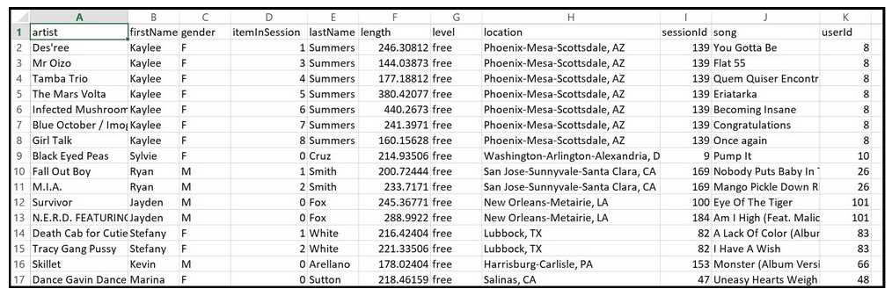

# Modelling of Music Event Data with Apache Cassandra
## Introduction
For our devised project, a startup called **Sparkify** wants to analyze the data they've been collecting on songs and user activity on their new music streaming app. The analysis team is particularly interested in understanding what songs users are listening to. Currently, there is no easy way to query the data to generate the results, since the data reside in a directory of CSV files on user activity on the app.

They'd like a data engineer to create an `Apache Cassandra database` which can create queries on song play data to answer the questions, and wish to bring you on the project. Your role is to create a database for this analysis. You'll be able to test your database by running queries given to you by the analytics team from Sparkify to create the results.

### What is Apache Cassandra? 
As it is stated on the Apache [homepage](https://cassandra.apache.org/_/index.html):

"Apache Cassandra is an **open source NoSQL distributed database** trusted by thousands of companies for scalability and high availability without compromising performance. Linear scalability and proven fault-tolerance on commodity hardware or cloud infrastructure make it the perfect platform for mission-critical data."

## Project Details
### ETL Pipeline
We implement a **Python ETL pipeline** that transfers data from a set of CSV files within a directory to create a streamlined CSV file to model and insert data into Apache Cassandra tables.

The first 2 rows of the data from the original .csv file include the following list of items:
- 'Barry Tuckwell/Academy of St Martin-in-the-Fields/Sir Neville Marriner', 'Logged In', 'Mohammad', 'M', '0', 'Rodriguez', '277.15873', 'paid', 'Sacramento--Roseville--Arden-Arcade, CA', 'PUT', 'NextSong', '1.54051E+12', '961', 'Horn Concerto No. 4 in E flat K495: II. Romance (Andante cantabile)', '200', '1.54328E+12', '88'
- 'Jimi Hendrix', 'Logged In', 'Mohammad', 'M', '1', 'Rodriguez', '239.82975', 'paid', 'Sacramento--Roseville--Arden-Arcade, CA', 'PUT', 'NextSong', '1.54051E+12', '961', 'Woodstock Inprovisation', '200', '1.54328E+12', '88'

The **event_datafile_new.csv** file contains the following columns: 
- artist 
- firstName of user
- gender of user
- item number in session
- last name of user
- length of the song
- level (paid or free song)
- location of the user
- sessionId
- song title
- userId

The image below is a screenshot of the denormalized data from the **event_datafile_new.csv** after the ETL pipeline has been running: 

### Create queries 
The three queries of the data we have to create tables for are:

1. **Give me the artist, song title and song's length in the music app history that was heard during  sessionId = 338, and itemInSession  = 4**
2. **Give me only the following: name of artist, song (sorted by itemInSession) and user (first and last name) for userid = 10, sessionid = 182**
3. **Give me every user name (first and last) in my music app history who listened to the song 'All Hands Against His Own'**

### Create tables
Next step is the creation of tables to run such queries. Remember, with Apache Cassandra you model the database tables on the queries you want to run. So, we create one specific table for each single query.

Afterwards a SELECT-statement is given for the required query conditions given by Sparkify to validate our tables creation.

### Summary
- For implementation details see the coding of the projects jupyter notebook.
- This project coding is released under the [MIT license](https://github.com/IloBe/Music_DataModelling_with_ApacheCassandra/blob/main/LICENSE).
